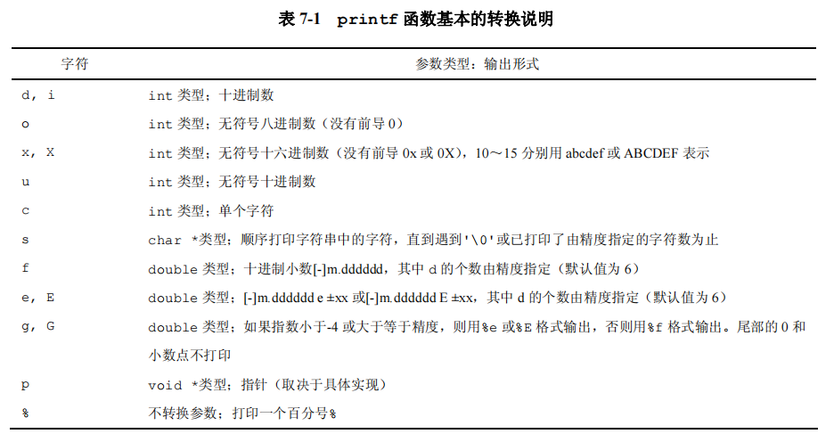
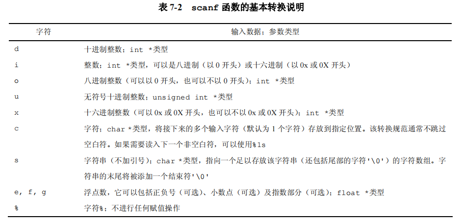

# 第七章 输入输出

## 7.1 标准输入输出

```c
int getchar (void) 		//获取一个字符
int tolower (int)  		//大写转小写
int putchar(int __c)	//输出一个字符
```

## 7.2 格式化输出 printf函数



## 7.3 变长参数表

> 通过 #include <stdarg.h> 标准库实现可变参数表

```c
#include <stdio.h>
#include <stdarg.h>

void minprintf(char *str, ...);

int main(){
    minprintf("HelloWorld ! %d %s", 123, "str");
    return 0;
}

void minprintf(char *str, ...){
    va_list ap;
    int ival;
    float fval;
    char *sval;
    va_start(ap, str);
    for(; *str; str++){
        if(*str != '%'){
            putchar(*str);
            continue;
        }
        switch(*++str){
            case 'd':
                ival = va_arg(ap, int);
                printf("%d", ival);
                break;
            case 'f':
                fval = va_arg(ap, double);
                printf("%f", fval);
                break;
            case 's':
                sval = va_arg(ap, char*);
                while(*sval){
                    putchar(*(sval++));
                }
                break;
            default:
                putchar(*str);
        }
    }

}
```

## 7.4 格式化输入

```c
int main(){
    int num;
    printf("input num: ");
    scanf("%d", &num);
    printf("put num : %d", num);

    return 0;
}
```



## 7.5 文件访问

实现 Cat命令的效果

```C
#include <stdio.h>

int main(int argc, char *argv[]){
    char *fileName = argv[1];
    FILE *file = fopen(fileName, "r");

    if(file == NULL){
        printf("文件不存在!");
        return 0;
    }

    char c;
    while((c = fgetc(file)) != EOF){
        printf("%c", c);
    }
    return 0;
}
```

`FILE* fopen(fileName, "r");` 打开文件

`int fgetc(file)` 读取文件内容

 ` int putc(int c, FILE *fp)` 写入文件内容

`int fscanf(FILE *fp, char *format, ...)`  格式化文件输入

`int fprintf(FILE *fp, char *format, ...)` 格式化文件输出