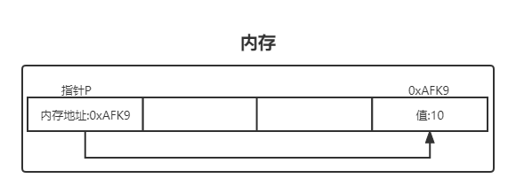

# 第五章 指针与数组

## 5.1 指针与地址

指针存储的是 内存的地址，通过指针的内存地址可以直接获取到指向的对象的值。



```c
int main(){
    //*p 表示指针类型
    int x = 0, y = 2, *p;
    //p 指针指向 x的地址
    p = &x;
    //y 的值现在是 x的值
    y = *p;
    //x 的值现在是3
    *p = 3;
    //p2 和 p 都指向x 并且把值改成了4
    int *p2 = p;
    *p2 = 4;
    return 0;
}
```

## 5.2 指针与函数参数

```c
//指针类型参数
int swap(int *num, int *num2){
    int temp = *num;
    *num = *num2;
    *num2 = temp;
}
```

## 5.3 指针与数组

C语言中数组变量表示数组第一个元素的地址，C语言中数组的下一个元素等于数组的引用地址 + 1，第二个元素就是 + 2，以此类推

```C
int array[] = {10, 20, 30};
int *p = array;
*p //表示数组第一个元素
*p++ //表示数组第二个元素
*p += 2//表示数组第三个元素
//*p++ 和 *(array+1) 是等价的
```

## 5.5 字符指针与函数 实现C函数库里的strcpy函数

```c
void strcpy_func(char *s, char *t){
    int i = 0;
    while((s[i] = t[i]) != '\0'){
        i++;
    }
}

void strcpy_fun2(char *s, char *t){
    while((*s = *t) != '\0'){
        s++;
        t++;
    }
}

void strcpy_fun3(char *s, char *t){
    while(*s++ = *t++)
        ;
}
```

## 5.7 多维数组

```c
//二维数组
int array[2][2] = {
    {1,2},
    {3,4}
};

for(int i = 0; i < 2;i++){
    for(int j = 0;j < 2;j++){
        printf("%d\t", array[i][j]);
    }
}

printf("\n");

//三维数组
int array2[2][2][2] = {
    {
        {1,2},
        {3,4}
    },
    {
        {5,6},
        {7,8}
    }
};
for(int i = 0;i < 2;i++){
    for(int j = 0;j < 2;j++){
        for(int k = 0;k < 2;k++){
            printf("%d\t", array2[i][j][k]);
        }
    }
}
```

## 5.8 指针数组的初始化

```c
char *month_name(int n){
    static char *name[] = {
        "Illegal month",
        "January", "May", "June",
        "July", "August", "September",
        "October", "November", "December"
    };
    return name[n];
}
```

## 5.9 指针与多维数组

```c
//数组
int a[][2] = {
    {1, 2},
    {3, 4}
};

//指针数组 指针数组里有两个 int类型的数组
int *b[2];
int array[2] = {1, 2};
int array2[2] = {3, 4};
b[0] = array;
b[1] = array2;

printf("%d\t%d", a[0][0], b[0][0]);
```

## 5.10 命令行参数

> C语言命令行参数传递的方式：
>
> 第一个参数  int argc 表示 参数的个数
>
> 第二个参数字符型数组指针 char *argv[] 表示每个参数的内容
>
> 例如 find -s abc -r a  那么 argc 的值为3   argv数组指针中的每个内容就是  ["-s",  "abc",  "-r",  "a"]

### 1. 实现 echo 程序

```c
/**
 * 实现echo程序
 */
int main(int argc, char *argv[]){
    for(int i = 0; i < argc;i++){
        printf("%s\t", argv[i]);
    }
    return 0;
}
```

### 2. 设计实现 find 程序查找单字符

```c
/**
 * 和书中的find不同自己设计的   
 * find -s 字符串 -r 匹配值  返回 -s字符串中匹配到的索引开始位置
 * ./find -s jasdlfjdsaklg -r a     返回：index: 2 index: 10
 */
int main(int argc, char *argv[]){
    char *str;
    char *regex;
    while(--argc > 0){
        char *arg = *++argv;
        // printf("[%d]%s\t",argc, arg);
        //通过参数 取到参数的值
        if(strcmp(arg, "-s") == 0){
            str = *(argv+1);
            // printf("%s", str);
        }
        
        //通过参数取到参数的值
        if(strcmp(arg, "-r") == 0){
            regex = *(argv+1);
            // printf("%s", regex);
        }
    }

    int i = 0;
    while(str[i]){
        char c = str[i++];
        if(c == *regex){
            printf("index: %d\n", i);
        }
    }

    return 0;
}
```

