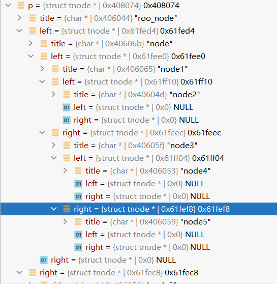

# 第六章 结构

## 6.1 结构体的基本知识

### 定义结构体

```c
//定义结构体
struct point{
    int x;
    int y;
};

//定义结构体的同时创建结构体变量 p2
struct point2{
    int x;
    int y;
} p2;

//定义结构体变量
struct point p = {1,2};
//输出结构体的 数据
printf("x: %d\t y: %d\n", p.x, p.y);
```

## 6.2 结构与函数

### 结构体参数的函数

```c
//定义结构体的参数的函数
struct point sum(struct point p1, struct point p2){
    struct point sum = {
        p1.x + p2.x,
        p1.y + p2.y
    };
    return sum;
}
```

### 结构体的指针

```c
//定义结构体指针
struct point *p = &sumPoint;
//结构体指针取值
int x = (*p).x; //这里必须要加括号因为 .的优先级高于 ()
printf("(*p).x: %d\n",  x);

//C语言中提供一种简写
x = p -> x;
int y = p -> y;
printf("p -> x: %d \t p -> y: %d", x, y);
```

## 6.3 结构体数组

```c
#include <stdio.h>

//定义结构数组
struct point
{
    int x;
    int y;
} pointArray[] = {
    {1,2},
    {2,3},
    {3,4}
};

int main(){
    int size = sizeof pointArray / sizeof pointArray[0];
    printf("size: %d \n", size);

    for(int i = 0;i < size;i++){
        struct point obj = pointArray[i];
        printf("x: %d \t y: %d \n", obj.x, obj.y);
    }

    printf("\n");

    //第二种初始化
    struct point pointArray2[] = {
        {9, 8},
        {7, 6}
    };
    size = sizeof (pointArray2) / sizeof (pointArray2[0]);
    for(int i = 0;i < size;i++){
        struct point obj = pointArray2[i];
        printf("x: %d \t y: %d \n", obj.x, obj.y);
    }
    return 0;
}
```

## 6.4 指向结构的指针

> 指向结构的指针可以通过  -> 箭头的方式进行获取值， -> 箭头这也是在C语言中唯一的作用

```c
struct student{
    char *name;
    int age;
} stu={"xiaoming", 18}, *p = &stu;

int main(){
    printf("%s \t %d\n", p->name, p->age);

    //定义结构指针
    struct student stu2 = {
        "xiaozhang", 20
    };
    struct student *p2 = &stu2;
    printf("%s \t %d\n", p2->name, p2->age);
    return 0;
}
```

参考文章：http://c.biancheng.net/view/2033.html

## 6.5 自引用结构

自引用结构大概就是数据结构中的树比较好的形象，自己的机构体体中有自己的结构体



```c
//定义一个树结构
struct tnode{
    char *title;
    struct tnode *left;
    struct tnode *right;
} root;

//递归打印树结构
void printTree(struct tnode *tree){
    if(tree != NULL){
        printf("%s\n", tree->title);
        printTree(tree->left);
        printTree(tree->right);
    }
}
```

## 6.7 类型定义(typedef)

> C语言允许通过 typedef 关键字，给数据类型定义别名

```c
int main(){
    typedef int Length;
    Length num = 10;
    printf("%d\n", num);

    //定义 String 类型
    typedef char* String;
    String str = "Hello World !";
    printf("%s", str);

    return 0;
}
```

