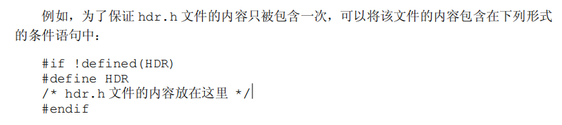
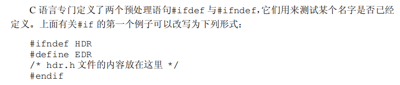

# 第四章 函数与程序结构

> 函数的作用：把一个大的功能逻辑拆分成一个个小的功能逻辑，并且可以复用

函数的定义：

```c
返回值类型 函数(参数声明表)
{
    声明和语句
}
```

## 4.5 头文件

定义头文件 math.h

```c
#define PI 3.1415926

int sum(int num, int num2);
```

实现头文件

```c
#include "math.h"

int sum(int num, int num2){
    return num + num2;
}
```

调用头文件中的函数

```c
#include <stdio.h>
#include "math.h"

int main(){
    int result = sum(10,20);
    printf("%f\n", PI);
    printf("sum:%d", result);
    return 0;
}
```

编译：`gcc -o main main.c math.c`

## 4.7 寄存器变量

```c
register int a = 0;
```

书中原话：register 声明告诉编译器，它所声明的变量在程序中使用频率较高，其思想是将 register 变量放在机器的寄存器中，这样可以使程序更小，执行速度更快。但编译器可以忽略此选项。或者存在某种限制，不一定什么类型都可以都放到寄存器里。

## 4.11.3 条件包含




