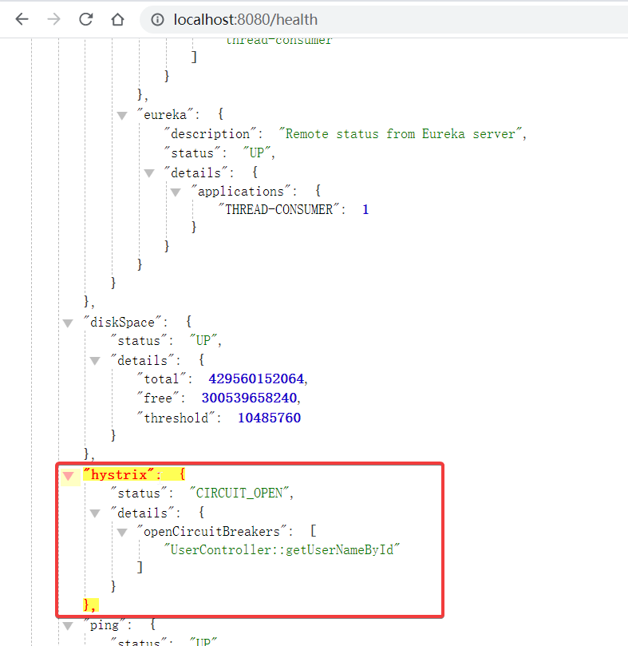
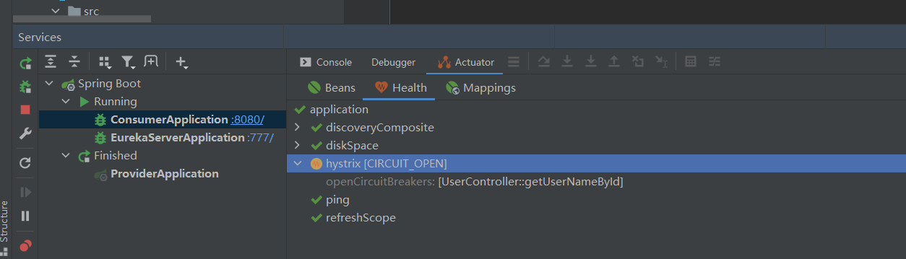
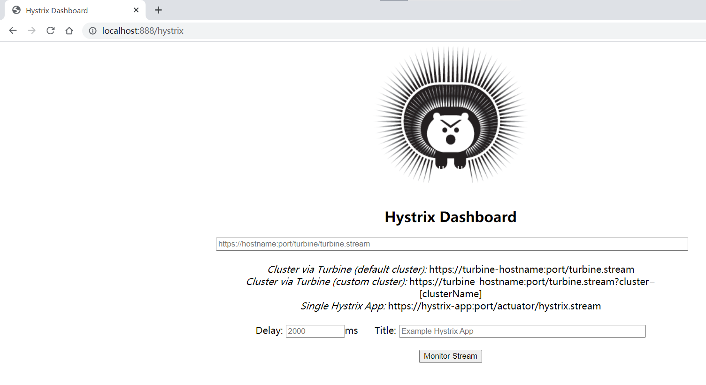
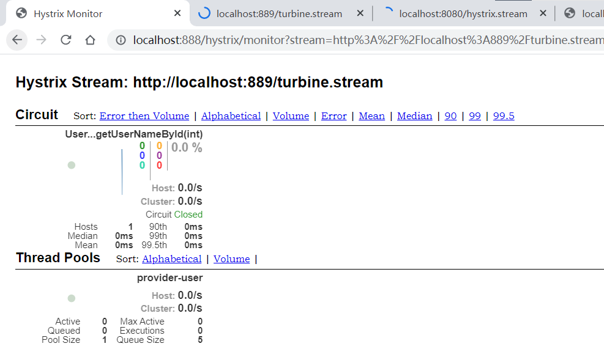
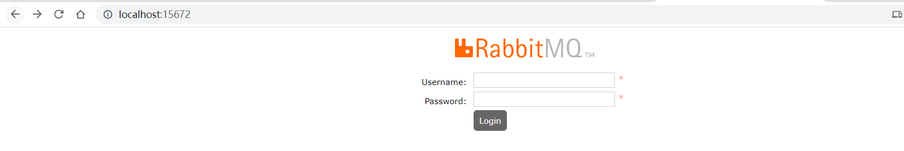

# 7. 使用 Hystrix 实现容错

## 7.1.1 雪崩效应


## Hystrix 如果实现容错

Hystrix 提供了一个断路器机制，下面是它的一个运行逻辑

正常情况下 服务A 调用 服务B 能成功的情况下 断路器关闭状态

服务A 调用 服务B 调用不成功 没有到 Hystrix 的阀值 断路器关闭状态，如果到了阀值那么 断路器会进入打开状态

断路器打开一段的时间不在请求依赖的服务，等过一段时间后会进入半开状态，断路器可允许其中一次请求，去尝试请求依赖的服务，如果还是请求失败那么，断路器重新进入打开状态，不在请求依赖的服务，循环往复，直到断路器半开状态，其中一次请求能请求通依赖的服务后，断路器会重新进入关闭状态，服务之间正常调用

## 7.2 使用 Hystrix 实现容错

### 7.2.2 使用通用方式整合Hystrix RestTemplat	e

#### 导入Hystrix的依赖

```xml
<!--Hystrix依赖-->
<dependency>
    <groupId>org.springframework.cloud</groupId>
    <artifactId>spring-cloud-starter-netflix-hystrix</artifactId>
    <version>2.2.4.RELEASE</version>
</dependency>
```

#### 通过@HystrixCommand注解实现容错

```java
/**
 * 调用用户服务 根据用户id 获取用户名称
 * @param id
 * @return
 */
@RequestMapping("/getUserNameById")
//HystrixCommand容错 设置请求失败后的设置回退方法
@HystrixCommand(fallbackMethod = "getUserNameByIdFallBack" 
                /*, ignoreExceptions = {ArithmeticException.class}*/) 
public String getUserNameById(int id){
    //通过 ignoreExceptions 设置过滤掉的异常 当触发这类异常时候不进行容错
    int i = 10 / 0;
    String url = "http://localhost:8081/getUserNameById?id={0}";
    String userName = restTemplate.getForObject(url, String.class, id);
    return userName;
}

/**
 * 获取用户名称失败后的回退方法 返回一个默认的用户名
 * @param id
 * @return
 */
public String getUserNameByIdFallBack(int id, Throwable throwable){
    throwable.printStackTrace();
    return "错误信息：" + throwable.toString() + "<br/>我是回退方法的用户名Default";
}
```

通过@HystrixCommand注解在RestTemplate方法级别上加上容错，保证在方法失败返回异常的时候，进行一个容错处理，就是指定的`fallbackMethod`的回退方法的处理，来进行一个错误后的回退处理。`ignoreExceptions`属性可以指定在出现某种异常时不进行容错

### 7.2.3 Hystrix 断路器的状态监控与深入理解

#### 利用SpringBootActuator监控模块查看断路器状态

引入监控依赖

```xml
<!--集成监控模块-->
<dependency>
    <groupId>org.springframework.boot</groupId>
    <artifactId>spring-boot-starter-actuator</artifactId>
</dependency>
```

配置监控的设置

```yaml
#Actuator 配置访问的路径是 根路径/ 然后 暴露全部监控接口
management:
  endpoints:
    web:
      exposure:
        include: "*" #配置暴露全部的监控接口
      base-path: /  #配置访问路径
  endpoint:
    health:
      show-details: always  #配置健康接口显示详细信息
```

#### 查看Hystrix健康状态

> Hystrix 状态：
>
> 默认如果 status = UP  断路器是关闭 一切正常
>
> 如果是 status = CIRCUIT_OPEN 说明短路器是打开状态，表示服务不可用状态

通过地址访问链接的形式查看



通过IDEA的Services的Health功能查看



### 7.2.4 Hystrix 线程隔离策略 与 传播上下文

> Hystrix 隔离策略    线程隔离  和 信号量隔离
>
> 线程隔离 ：默认方式，使用这种方式HystrixCommand将会在单独的线程上执行，收到线程池数量的限制
>
> 信号量隔离：使用这种方式HystrixCommand将在调用线程上执行，并发请求收到信号量大小的限制

配置隔离策略

```java
@HystrixCommand(fallbackMethod = "stubMyService",commandProperties = {
    //value = "SEMAPHORE" | "THREAD"
    @HystrixProperty(name = "execution.isolation.strategy", value = "SEMAPHORE")
})
@RequestMapping("/hello")
public void hello(){

}
```

### 7.2.5 Feign 使用 Hystrix

开启 Hystrix 的支持

```yaml
#开启Feign对于Hystrix的容错
feign:
  hystrix:
    enabled: true
```

#### 7.2.5.1 为 Feign 添加回退

FeignClient 提供一个 fallback 属性，这个属性配置一个当前FeignClient接口的一个实现类，走回退的时候会走实现里的同名方法

```java
/**
 * 用户服务的FeignClient
 * @author Thread丶
 */
@FeignClient(name = "provider-user",fallback = UserFeignClientImpl.class)
public interface UserFeignClient {
    /**
     * 根据用户id 获取用户名称
     * @param id
     * @return
     */
    @RequestMapping(value = "/getUserNameById", method = RequestMethod.GET)
    public String getUserNameById(@RequestParam int id);
}

/**
 * 第一种方式 实现FeignClient接口 实现Hystrix容错 但是获取不到异常信息
 */
@Component
class UserFeignClientImpl implements UserFeignClient{
    @Override
    public String getUserNameById(int id) {
        return "default";
    }
}
```

#### 7.2.5.2 通过 FallbackFactory 检查回退原因

FeignClient 注解还提供一个，fallbackFactory 属性 用于配置 FallbackFactory 属性的实现类，这个接口提供一个create方法用于返回这个FeignClient接口的一个实现类，相当于封装了一层对象，这个 create方法提供一个Throwable 参数用于获取回退的异常信息

```java
/**
 * 用户服务的FeignClient
 * @author Thread丶
 */
@FeignClient(name = "provider-user", fallbackFactory = UserFeignFallbackFactory.class)
public interface UserFeignClient {
    /**
     * 根据用户id 获取用户名称
     * @param id
     * @return
     */
    @RequestMapping(value = "/getUserNameById", method = RequestMethod.GET)
    public String getUserNameById(@RequestParam int id);
}

/**
 * 第二种方式 实现 FallbackFactory 接口 提供Throwable获取错误信息
 */
@Component
class UserFeignFallbackFactory implements FallbackFactory<UserFeignClient> {
    @Override
    public UserFeignClient create(Throwable throwable) {
        throwable.printStackTrace();
        return new UserFeignClient() {
            @Override
            public String getUserNameById(int id) {
                return "default";
            }
        };
    }
}
```

#### 7.2.5.3 为 Feign 禁用 Hystrix

全局禁用Hystrix

```yaml
feign:
  hystrix:
    enabled: false  #全局禁用
```

为单个 FeignClient 禁用 Hystrix

```java
@FeignClient(name = "provider-user", configuration = FeignDisableHystrixConfiguration.class)
public interface UserFeignClient {
   ......
}

class FeignDisableHystrixConfiguration {
    @Bean
    @Scope("prototype")
    public Feign.Builder feignBuilder(){
        return new Feign.Builder();
    }
}
```

### 7.3 Hystrix 的监控

默认 Hystrix 提供一个监控的信息页面，但是是 json 格式实时刷新的，但是缺点是不是图形化界面显示

**URL :  ** `http://localhost:8080/hystrix.stream`

### 7.4 使用 Hystrix Dashboard 可视化监控数据

这里可以新建一个模块引入依赖，主要是Hystrix 和 Hystrix-dashboard 这两个依赖

```xml
 <!--Hystrix Dashboard图形化监控-->
<dependency>
    <groupId>org.springframework.cloud</groupId>
    <artifactId>spring-cloud-starter-netflix-hystrix-dashboard</artifactId>
    <version>2.2.4.RELEASE</version>
</dependency>

<dependency>
    <groupId>org.springframework.cloud</groupId>
    <artifactId>spring-cloud-starter-netflix-hystrix</artifactId>
    <version>2.2.4.RELEASE</version>
</dependency>

<dependency>
    <groupId>org.springframework.boot</groupId>
    <artifactId>spring-boot-starter-actuator</artifactId>
</dependency>
```

启动HystrDashboard，在启动类上开启  `@EnableHystrixDashboard` 监控功能

访问这个模块的 `http://localhost:888/hystrix` 就可以看到监控页面，

最上面的url填 `http://localhost:8080/hystrix.stream` 每个服务的监控数据的url，

然后下面是 Delay 延迟毫秒数， Title监控的标题





### 7.5 使用 Turbine 聚合监控数据

> Turbine 可以同时监控多个微服务，把所有的微服务的数据汇合到一起，
>
> 然后通过统一的url：`http://localhost:889/turbine.stream`获取全部数据，
>
> 配合 HystrDashboard 图形化显示全部微服务的监控情况

这里也是新建一个模块，然后添加依赖，Turbine 需要注册到Eureka上，因为要获取服务注册信息

```xml
<dependency>
    <groupId>org.springframework.cloud</groupId>
    <artifactId>spring-cloud-starter-netflix-hystrix-dashboard</artifactId>
    <version>2.2.4.RELEASE</version>
</dependency>

<!--引入Turbine监控多个微服务-->
<dependency>
    <groupId>org.springframework.cloud</groupId>
    <artifactId>spring-cloud-starter-netflix-turbine</artifactId>
    <version>2.2.4.RELEASE</version>
</dependency>

<dependency>
    <groupId>org.springframework.cloud</groupId>
    <artifactId>spring-cloud-starter-netflix-eureka-client</artifactId>
    <version>2.2.4.RELEASE</version>
</dependency>

<dependency>
    <groupId>org.springframework.cloud</groupId>
    <artifactId>spring-cloud-starter-netflix-hystrix</artifactId>
    <version>2.2.4.RELEASE</version>
</dependency>
```

这里主要是配置 turbine.app-config 设置要监控的多个微服务，名称就是 Eureka 里的服务名

```yaml
server:
  port: 889

spring:
  application:
    name: hystrix-turbine
    
#配置EurekaCleint
eureka:
  client:
    fetch-registry: true
    register-with-eureka: true
    service-url:
      defaultZone: http://localhost:777/eureka
  instance:
    prefer-ip-address: true

#配置Turbine监控设置
#turbine url  http://localhost:889/turbine.stream
turbine:
  app-config: thread-consumer #配置汇总监控信息的服务,这里可以写多个服务名
  cluster-name-expression: "'default'"
  #这个属性可能联想不出来  但是可以设置 instanceUrlSuffix 因为默认访问服务的都是 http://localhost:889/xxx/turbine.stream
  instanceUrlSuffix: hystrix.stream
```

在启动类上开始Turbine功能，增加注解 `@EnableTurbine`，然后访问 `http://localhost:889/turbine.stream`就可以看到汇总的数据了

### 7.6 使用消息中间件收集数据 RabbitMQ

这里我用Docker 镜像版的 RabbitMQ ，不知道为啥windows版本地老是报错

```bash
#拉取docker镜像
docker pull rabbitmq
#启动rabbitmq
docker run -d --name rabbitmq -p 15672:15672 -p 5672:5672 rabbitmq
#进入容器安装 图形化管理界面
docker ps #看一下那个容器id
docker exec -it a69bba256723 bash
#安装图形化管理界面
rabbitmq-plugins enable rabbitmq_management
```

然后就可以访问管理了，用户名和密码默认是 guest guest



